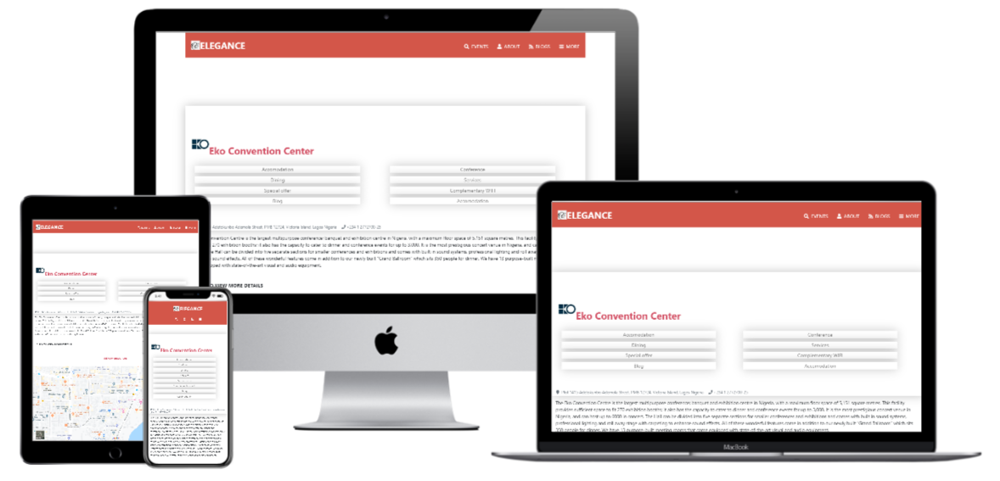

# Capstone-project
This is a capstone project for the Microverse HTML/CSS course. It is a directory of event using HTML, CSS3, Bootstrap, and Font awesome.

## Screenshots

## Link to the original website

[Original version](https://www.behance.net/gallery/25563385/PatashuleKE)

## Implementation

- The project is built using Html and CSS,  Bootstrap CSS framework, flex and grid positioning.

- Users can see the list of events center grouped into different categories such as Arts, Business, Recreation...

- Users can search for events center by venue and location.

- On the details page, Users can see the direction to the venue...

- The company logo is animated and the background-image-container.

- The Footer section has a navigation area for easy access.

## Built With

- HTML
- CSS3
- Bootstrap
- Font awesome icons
- Webhint/Stylelint linters

## Live Demo

[Live Demo index page](https://rawcdn.githack.com/GraceOyiza/Capstone-project/8f4ae61d29e1becf2129db29cacc8e6ec4ea746a/index.html)

[Live Demo search page](https://rawcdn.githack.com/GraceOyiza/Capstone-project/8f4ae61d29e1becf2129db29cacc8e6ec4ea746a/search.html)

[Live Demo details page](https://rawcdn.githack.com/GraceOyiza/Capstone-project/8f4ae61d29e1becf2129db29cacc8e6ec4ea746a/details.html)

# Getting Started

 To get a local copy up and running follow these simple example steps.

## Prerequisites
- GIT

- BROWSER

## Setup
- Clone this repo

- cd into the cloned repo

- Open the index.html file with any browser of your choice

### Linters

1. run `npm install`.
2. run `npm run test` to check the Html and Css files.

### Deployment

Install and run a live server plugin on you IDE/Text editor and run it from the root directory.

## Author

👤 **Popoola Grace Boluwatife**

- Github: [@GraceOyiza](https://github.com/GraceOyiza)
- Twitter: [@_PopsonGrace](https://twitter.com/_PopsonGrace)
- LinkedIn: [@grace](https://www.linkedin.com/in/grace-popoola)

## Show your support

Give a ⭐️ if you like this project!

## Acknowledgments
- MICROVERSE
